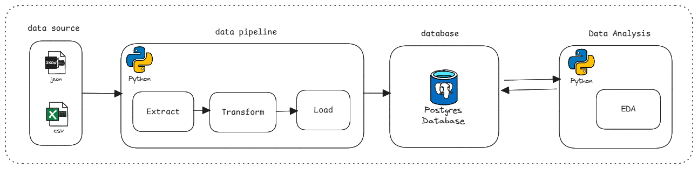

# 🏆 ETL Pipeline - Données de la Coupe du Monde FIFA

[](https://www.python.org/downloads/)
[](LICENSE)
[](test/)

## 📋 Description

Ce projet implémente un pipeline ETL (Extract, Transform, Load) complet pour consolider et analyser les données historiques des matchs de la Coupe du Monde FIFA de 1930 à 2022. Le système extrait les données de multiples sources (CSV et JSON), les transforme pour assurer leur cohérence, et les charge dans une base de données PostgreSQL.

### 🎯 Objectifs du projet

- **Centraliser** les données de plusieurs éditions de la Coupe du Monde (1930-2010, 2014, 2018, 2022)
- **Normaliser** les formats de données hétérogènes provenant de différentes sources
- **Harmoniser** les informations (noms d'équipes, stades, résultats)
- **Stocker** les données dans une base PostgreSQL pour faciliter l'analyse
- **Garantir** la qualité des données avec une suite de tests


## 🛠️ Technologies utilisées

### Langages et frameworks

- **Python 3.10+** - Langage principal
- **pandas** - Manipulation de données
- **SQLAlchemy** - ORM et connexion base de données
- **psycopg2** - Driver PostgreSQL
- **pytest** - Framework de tests

### Outils de développement

- **Jupyter** - Notebooks d'analyse
- **pytest-cov** - Couverture de code
- **python-dotenv** - Gestion des variables d'environnement
- **PyYAML** - Parsing de configuration

### Base de données

- **PostgreSQL** - Système de gestion de base de données relationnelle
## 🔄 Architecture globale



### 1. **Extract** - Extraction des données


Le module `extract.py` gère l'extraction depuis différentes sources :

- **CSV** : Lecture automatique avec détection du délimiteur (`,`, `;`, `|`, `\t`)
- **JSON** : Parsing de structures imbriquées (équipes, stades, groupes, matchs)

```python
# Extraction automatique avec gestion des séparateurs
df = fct_read_csv(file_path)

# Lecture de JSON complexe
dfs = fct_read_json_nested(json_path)
```

### 2. **Transform** - Transformation et nettoyage

Le module `transform.py` normalise les données :

- Standardisation des noms de colonnes
- Conversion des formats de dates
- Harmonisation des noms d'équipes et de stades
- Mapping des phases du tournoi (groupes, huitièmes, quarts, etc.)
- Gestion des valeurs manquantes
- Validation des types de données

```python
# Transformation par édition
df_2010_clean = fct_transform_2010(df_2010, config)
df_2014_clean = trf_file_wcup_2014(df_2014, config)
df_2018_clean = fct_transform_data_2018(dfs_2018, config)
df_2022_clean = transform_2022_data(df_2022, config)
```

### 3. **Load** - Chargement en base

Le module `load.py` gère l'insertion dans PostgreSQL :

- Création automatique du schéma de table
- Insertion avec gestion des transactions
- Support de l'upsert (insert/update)

```python
# Création du moteur SQLAlchemy
engine = create_postgres_engine(host, database, user, password)

# Chargement des données
df_final.to_sql("matches", engine, if_exists="replace")
```

## 📊 Schéma de la base de données

### Table `matches`

| Colonne       | Type         | Description                           |
|---------------|--------------|---------------------------------------|
| `match_id`    | INTEGER (PK) | Identifiant unique du match           |
| `date`        | DATE         | Date du match                         |
| `home_team`   | VARCHAR(100) | Équipe à domicile                     |
| `away_team`   | VARCHAR(100) | Équipe à l'extérieur                  |
| `home_result` | INTEGER      | Score de l'équipe à domicile          |
| `away_result` | INTEGER      | Score de l'équipe à l'extérieur       |
| `stage`       | VARCHAR(50)  | Phase du tournoi                      |
| `edition`     | INTEGER      | Année de l'édition                    |
| `city`        | VARCHAR(100) | Ville où s'est joué le match          |


## 🏗️ Architecture du projet

```
Brief-2-ETL-de-donnees-footballistiques-Wickets-Sprinters/
│
├── config.yaml                 # Configuration du pipeline ETL
├── main.py                     # Point d'entrée principal
├── requirements.txt            # Dépendances Python
├── pytest.ini                  # Configuration des tests
├── .env                        # Variables d'environnement (non versionné)
│
├── data/                       # Données sources
│   ├── matches_19302010.csv    # Matchs 1930-2010
│   ├── WorldCupMatches2014.csv # Matchs 2014
│   ├── data_2018.json          # Données 2018 (format JSON)
│   └── Fifa_world_cup_matches.csv # Matchs 2022
│
├── src/                        # Code source
│   └── etl/                    # Modules ETL
│       ├── __init__.py
│       ├── extract.py          # Extraction des données
│       ├── transform.py        # Transformation et nettoyage
│       ├── load.py             # Chargement en base de données
│       └── utils.py            # Fonctions utilitaires
│
├── test/                       # Tests unitaires
│   ├── __init__.py
│   ├── test_extract.py
│   ├── test_transform.py
│   ├── test_load.py
│   └── test_utils.py
│
├── notebook/                   # Notebooks d'analyse exploratoire
│   ├── notebook_19302010.ipynb
│   ├── notebook_2014.ipynb
│   ├── notebook_2018_extract.ipynb
│   ├── notebook_2018_transform.ipynb
│   └── notebook_2022.ipynb
│
└── src/eda/                    # Analyses exploratoires (EDA)
    └── eda_*.ipynb             # Notebooks EDA par membre d'équipe
```
## 🚀 Installation

### Prérequis

- Python 3.10 ou supérieur
- PostgreSQL 12 ou supérieur
- pip (gestionnaire de paquets Python)

### Étapes d'installation

1. **Cloner le dépôt**

```bash
git clone https://github.com/Simplon-DE-P1-2025/Brief-2-ETL-de-donnees-footballistiques-Wickets-Sprinters.git
cd Brief-2-ETL-de-donnees-footballistiques-Wickets-Sprinters
```

2. **Créer un environnement virtuel**

```bash
python -m venv .venv
source .venv/bin/activate  # Linux/Mac
# .venv\Scripts\activate   # Windows
```

3. **Installer les dépendances**

```bash
pip install -r requirements.txt
```

4. **Configurer les variables d'environnement**

Créez un fichier `.env` à la racine du projet :

```env
DB_HOST=localhost
DB_DATABASE=worldcup_db
DB_USER=votre_utilisateur
DB_PASSWORD=votre_mot_de_passe
```

5. **Créer la base de données PostgreSQL**

```bash
# Connexion à PostgreSQL
psql -U postgres

# Création de la base de données
CREATE DATABASE worldcup_db;
```

## 💻 Utilisation

### Exécution du pipeline complet

```bash
python main.py
```

Le pipeline va :
1. ✅ Extraire les données des fichiers sources
2. ✅ Transformer et nettoyer les données
3. ✅ Fusionner les datasets de toutes les éditions
4. ✅ Générer les identifiants uniques
5. ✅ Charger les données dans PostgreSQL

### Utilisation des modules individuels

```python
from src.etl.extract import fct_read_csv, fct_read_json_nested
from src.etl.transform import fct_transform_2010
from src.etl.load import create_postgres_engine

# Extraction
df = fct_read_csv("data/matches_19302010.csv")

# Transformation
df_clean = fct_transform_2010(df, config)

# Connexion à la base
engine = create_postgres_engine(host, database, user, password)
```

## 🧪 Tests

Le projet dispose d'une suite de tests complète avec une couverture de code de **85%**.

### Exécuter tous les tests

```bash
pytest
```

### Tests avec rapport de couverture

```bash
pytest --cov=./src --cov-report=term-missing
```

### Tests par module

```bash
# Test d'extraction
pytest test/test_extract.py

# Test de transformation
pytest test/test_transform.py

# Test de chargement
pytest test/test_load.py

# Test des utilitaires
pytest test/test_utils.py
```

### Exécuter des tests spécifiques

```bash
# Test d'une fonction précise
pytest test/test_extract.py::test_fct_read_csv -v

# Tests en mode verbose
pytest -v

# Arrêt au premier échec
pytest -x
```

## ⚙️ Configuration

Le fichier `config.yaml` centralise la configuration du pipeline :

### Structure de configuration

```yaml
# Chemins des fichiers sources
root_csv_2010: "data/matches_19302010.csv"
root_csv_2014: "data/WorldCupMatches2014.csv"
root_csv_2022: "data/Fifa_world_cup_matches.csv"
root_json_2018: "data/data_2018.json"

# Mapping des colonnes pour 2010
dict_columns_2010:
  year: date
  team1: home_team
  team2: away_team
  venue: city
  round: stage

# Normalisation des phases du tournoi
stage_mapping_2010:
  GROUP_STAGE: group_stage
  1/2_FINAL: semi_finals
  FINAL: final
  # ... autres mappings

# Colonnes à conserver
columns_to_keep_2010:
  - date
  - home_team
  - away_team
  - home_result
  - away_result
  - stage
```

## 📈 Analyses exploratoires (EDA)

Le dossier `notebook/` et `src/eda/` contiennent des analyses détaillées.


### Notebooks disponibles

| Notebook | Description |
|----------|-------------|
| `notebook_19302010.ipynb` | Analyse des données 1930-2010 |
| `notebook_2014.ipynb` | Analyse Coupe du Monde 2014 |
| `notebook_2018_extract.ipynb` | Extraction données 2018 |
| `notebook_2018_transform.ipynb` | Transformation données 2018 |
| `notebook_2022.ipynb` | Analyse Coupe du Monde 2022 |


## 👥 Équipe

### Wickets Sprinters : **Kaouter** | **Ashley** | **Ahmed**  | **Alexandre** 

## 📝 Licence

Ce projet est développé dans le cadre d'une formation à Simplon.


---

<div align="center">
  <strong>⚽ Développé avec passion pour le football et les données ⚽</strong>
  <br>
  <sub>Projet Simplon - Data Engineering - 2025</sub>
</div>
